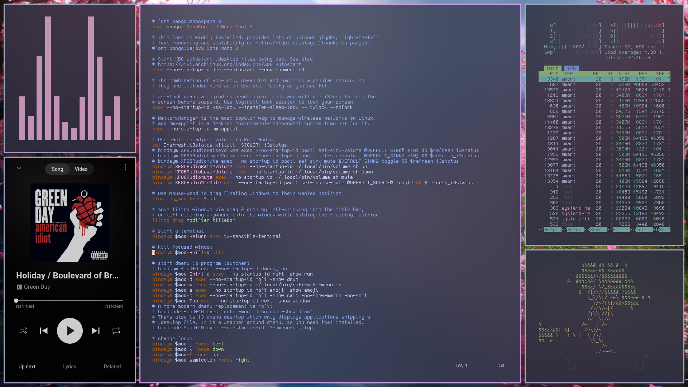

> I would like to use [i3](i3.md) without a bar because I want a clean desktop.

> I have used [i3status](https://i3wm.org/docs/i3status.html) and [i3blocks](https://vivien.github.io/i3blocks/), which were okay, but they weren't as clean as I wanted and had too many configurations for me.

---
### How can I know system status & etc. ?

> I use [dunst](https://dunst-project.org/)for check [System Information](System%20Information.md), [Volume](Volume.md), [Date & Time](Date%20&%20Time.md) , [Workspace](Workspace.md) check out my [Dunst](Dunst.md).

---
### Screenshot

